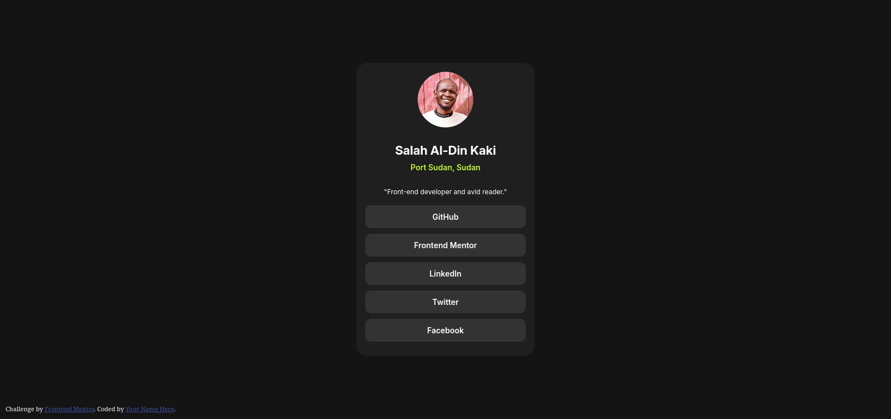

# Frontend Mentor - Social links profile solution

This is my solution to the [Social links profile challenge on Frontend Mentor](https://www.frontendmentor.io/challenges/social-links-profile-UG32l9m6dQ). Frontend Mentor challenges help you improve your coding skills by building realistic projects. 

## Table of contents

- [Overview](#overview)
  - [The challenge](#the-challenge)
  - [Screenshot](#screenshot)
  - [Links](#links)
- [My process](#my-process)
  - [Built with](#built-with)
  - [What I learned](#what-i-learned)
- [Author](#author)
- [Acknowledgments](#acknowledgments)

## Overview

### The challenge

Users should be able to:

- See hover and focus states for all interactive elements on the page

### Screenshot

### Links

- **Live Demo:** [View Live Site](https://social-linksprofile-filo.vercel.app/)  

## My process

### Built with

- Semantic HTML5 markup
- CSS custom properties
- Flexbox
- Mobile-first workflow
- [Sass](https://sass-lang.com/) - A CSS extension language  

### What I learned

This is my thread project, I’m incredibly proud of myself for completing it! Through this experience, I gained hands-on knowledge of front-end development workflows and improved my skills significantly.

## Author

- Frontend Mentor - [@filostkana](https://www.frontendmentor.io/profile/filostkana)
- Twitter - [@filostkana](https://www.twitter.com/filostkana)
- Facebook - [@filostkana](https://www.facebook.com/filostkana)

## Acknowledgments

A big thanks to [Frontend Mentor](https://www.frontendmentor.io) for providing such amazing resources for developers. Their challenges are an excellent way to learn, grow, and gain practical experience in front-end development.  